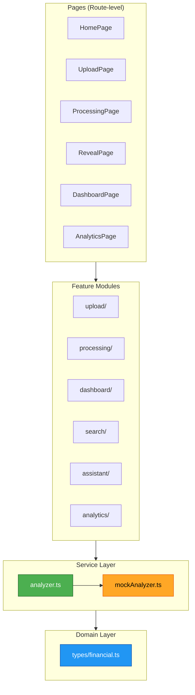

# Application Design — Financial Footprint Discovery Assistant

## Architecture Overview

Single-page React application with feature-based modular structure, strict service abstraction, and mock-first development approach.

## Component Architecture



## Folder Structure

```
src/
├── components/          # Shared UI components
│   ├── ui/              # shadcn/ui primitives (Button, Card, Badge, etc.)
│   ├── layout/          # App shell, Header, Footer, Container
│   └── feedback/        # Toast, ErrorBoundary, Loading
├── pages/               # Route-level page components
│   ├── HomePage.tsx
│   ├── UploadPage.tsx
│   ├── ProcessingPage.tsx
│   ├── RevealPage.tsx
│   ├── DashboardPage.tsx
│   └── AnalyticsPage.tsx
├── features/            # Feature modules (self-contained)
│   ├── upload/          # Drag-drop, file picker, validation
│   ├── processing/      # Multi-step progress indicator
│   ├── dashboard/       # Overview cards, category sections, executive summary
│   ├── search/          # Search bar, filters, sorting
│   ├── assistant/       # Inline AI chat interface
│   └── analytics/       # Placeholder cards
├── services/            # Backend abstraction
│   ├── analyzer.ts      # Public API — ONLY integration point
│   └── mockAnalyzer.ts  # Mock implementation
├── hooks/               # Shared custom hooks
├── types/               # Domain interfaces
│   └── financial.ts     # All domain types
├── mock/                # Mock data
│   └── financialFootprint.json
├── utils/               # Pure utility functions
├── App.tsx              # Router + layout wrapper
├── main.tsx             # Entry point
└── index.css            # Tailwind imports + global styles
```

## Service Layer Design

```typescript
// services/analyzer.ts — THE ONLY INTEGRATION POINT
export async function analyzeDocuments(files: File[]): Promise<FinancialFootprint> {
  // Current: mock implementation
  return mockAnalyzer(files);
  
  // Future: replace with single line
  // return postToBackend('/api/analyze', files);
}
```

**Rule**: No component outside `services/` may import from `mock/` or `mockAnalyzer.ts`.

## Data Flow

```
User uploads files
    → UploadPage stores File[] in local state
    → User clicks "Analyze"
    → Navigate to ProcessingPage
    → ProcessingPage calls analyzeDocuments(files)
    → analyzeDocuments() → mockAnalyzer() → returns FinancialFootprint
    → Navigate to RevealPage with result summary
    → User clicks "View Financial Footprint"
    → Navigate to DashboardPage with full FinancialFootprint data
```

## State Management

- **File state**: Local component state in UploadPage (passed via navigation state or context)
- **Analysis result**: Stored in a lightweight React Context after analysis completes
- **No global state library**: React Context + local state sufficient for MVP
- **Future**: TanStack Query can replace context for async state when real backend is connected

## Component Responsibilities

| Component | Responsibility |
|---|---|
| HomePage | Landing, product introduction, CTA to upload |
| UploadPage | File selection, validation, trigger analysis |
| ProcessingPage | Display multi-step progress, call analyzer service |
| RevealPage | Show completion summary, CTA to dashboard |
| DashboardPage | Executive summary, overview cards, categories, search, AI assistant |
| AnalyticsPage | Placeholder cards for future QuickSight integration |

## Key Design Decisions

1. **Single context for analysis results** — Avoids prop drilling across pages while keeping state simple
2. **Feature modules are self-contained** — Each feature folder has its own components, no cross-feature imports
3. **Pages are thin orchestrators** — They compose features but contain no business logic
4. **Service layer is the firewall** — Everything above it speaks only `FinancialFootprint` types
