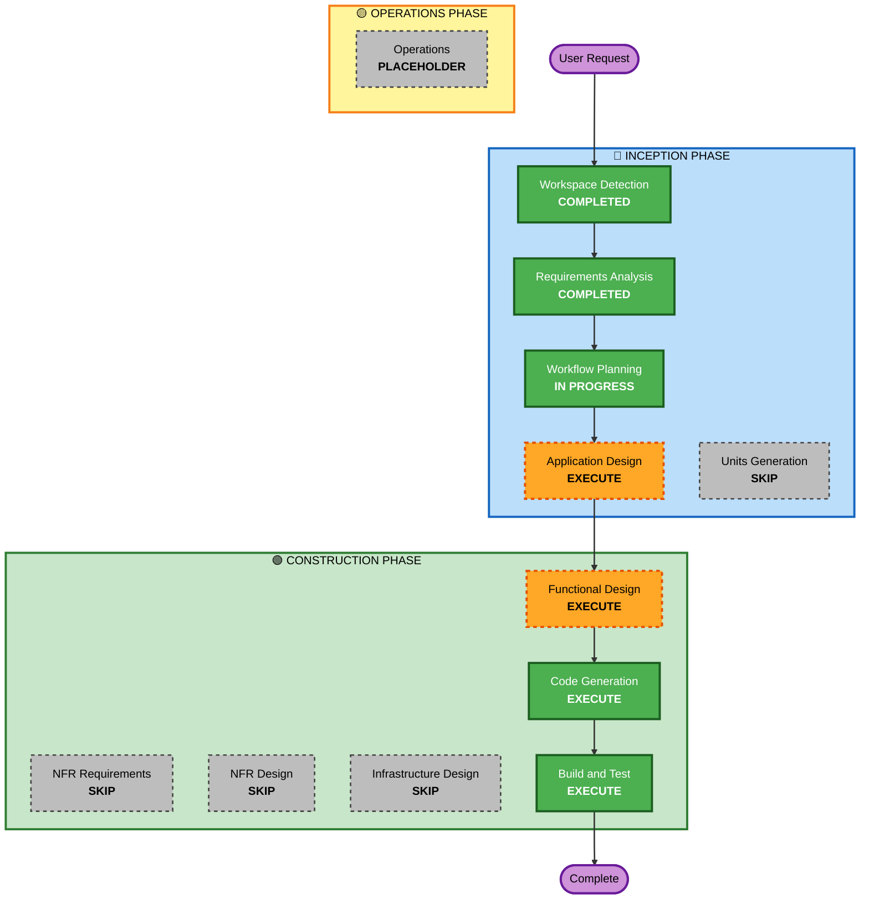

# Execution Plan

## Detailed Analysis Summary

### Transformation Scope
- **Transformation Type**: New greenfield frontend application
- **Primary Changes**: Full React/TypeScript/Vite application with 6 pages, domain layer, mock backend, and AWS integration readiness
- **Related Components**: None (greenfield)

### Change Impact Assessment
- **User-facing changes**: Yes — Entire application is user-facing
- **Structural changes**: Yes — New application architecture from scratch
- **Data model changes**: Yes — New domain model (7 TypeScript interfaces)
- **API changes**: Yes — New service abstraction layer with backend contract
- **NFR impact**: No — Security, resiliency deferred for hackathon

### Risk Assessment
- **Risk Level**: Low — Well-defined scope, clear tech stack, hackathon timeframe
- **Rollback Complexity**: Easy — Greenfield, no production dependencies
- **Testing Complexity**: Simple — Partial PBT deferred to post-MVP

## Workflow Visualization

## Phases to Execute

### 🔵 INCEPTION PHASE
- [x] Workspace Detection (COMPLETED)
- [ ] Reverse Engineering - SKIPPED (Greenfield)
- [x] Requirements Analysis (COMPLETED)
- [ ] User Stories - SKIPPED
  - **Rationale**: Hackathon project with clear requirements and single-developer/small-team execution. User stories add overhead without proportional value.
- [x] Workflow Planning (IN PROGRESS)
- [ ] Application Design - EXECUTE
  - **Rationale**: Component structure, service layer design, and folder organization needed before code generation. Lightweight pass focused on hackathon delivery.
- [ ] Units Generation - SKIP
  - **Rationale**: Single-unit application (one frontend app). No decomposition needed.

### 🟢 CONSTRUCTION PHASE
- [ ] Functional Design - EXECUTE
  - **Rationale**: Business logic for mock data generation, processing flow, and dashboard rendering needs definition. Lightweight — focused on data flow and component behavior.
- [ ] NFR Requirements - SKIP
  - **Rationale**: NFRs already defined in requirements. No separate tech stack decision needed (already specified).
- [ ] NFR Design - SKIP
  - **Rationale**: No resilience/security patterns to design for hackathon MVP.
- [ ] Infrastructure Design - SKIP
  - **Rationale**: Local development only. No infrastructure to design.
- [ ] Code Generation - EXECUTE (ALWAYS)
  - **Rationale**: Implementation of the full application. Hackathon-optimized task breakdown.
- [ ] Build and Test - EXECUTE (ALWAYS)
  - **Rationale**: Build verification and basic test instructions.

### 🟡 OPERATIONS PHASE
- [ ] Operations - PLACEHOLDER
  - **Rationale**: Future deployment and monitoring workflows

## Estimated Timeline
- **Total Stages to Execute**: 5 (Workflow Planning, Application Design, Functional Design, Code Generation, Build and Test)
- **Estimated Duration**: 2-day hackathon (optimized for speed)

## Success Criteria
- **Primary Goal**: Fully functional MVP with mocked data, ready for AWS backend swap
- **Key Deliverables**: Working React app with upload → processing → reveal → dashboard flow
- **Quality Gates**: Application compiles, runs, and demonstrates end-to-end flow
